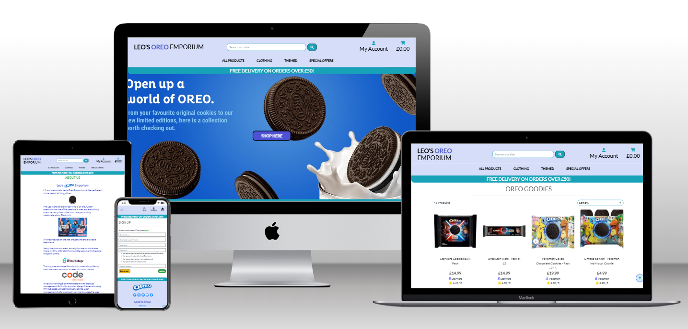

# leos_oreos_shop


**Author Neil Allen**

## Leo's Oreo Emporium

An E-commerce website to pay homage to my son's love of the biscuits themselves and everything Oreo. Built within a django framework; data structures follow those employed in similar applications with additions for enhanced functionality/complexity. 

[View the live project here.](https://leos-oreos-shop-2a6fc504879b.herokuapp.com/)

# Table of Contents

1. [Project Inception and Planning](#project-inception-and-planning)
2. [Overview](#overview)
3. [User Experience (UX)](#user-experience-ux)
    *   [User stories](#user-stories)
        *   [First Time Visitor Goals](#as-a-first-time-user-i-want-to)
        *   [Returning Visitor Goals](#as-a-registered-user-i-want-to)
        *   [Frequent User Goals](#as-an-admin-i-want-to)
    *   [Design](#design)
        *   [Colour Scheme](#colour-scheme)
        *   [Typography](#typography)
        *   [Imagery](#imagery)
        *  [Design Considerations](#design-considerations)
    *   [Database Design](#database-design)
        *   [Table Struture](#table-structure)
        *   [Diagram](#diagram)
    *   [Wireframes](#wireframes)
        *   [Base Template](#base)
        *   [Products](#products)
        *   [Details](#details)
        *   [Add Review](#add-a-review)
        *   [Edit Review](#edit-a-review)
        *   [Category](#category)
        *   [Shopping Cart](#shopping-cart)
        *   [Checkout](#checkout)
        *   [Checkout Success](#checkout-success)
        *   [Contact Us](#contact-us)
        *   [Management](#management)
    *   [Structure](#structure)
4. [Features](#features)
5. [Pages](#pages)
    *   [Common pages](#common-pages)   
    *   [User Pages](#user-pages)
    *   [Admin pages](#admin-pages)
    *   [Site Features](#site-features)
6. [Technologies Used](#technologies-used)
    *   [Development Environment](#development-environment)
    *   [Languages Used](#languages-used)
    *   [Frontend Frameworks & Libraries](#frontend-frameworks--libraries)
    *   [Backend Modules/Packages & Frameworks](#backend-modules--packages--frameworks)
    *   [Databases](#databases)
    *   [Other Tools](#other-tools)
7. [Testing](#testing)
    *   [HTML](#html)
    *   [CSS](#css)
    *   [JavaScript](#javascript)
    *   [pep8](#pep8)
    *   [Testing User Stories from User Experience (UX) Section](#testing-user-stories-from-user-experience-ux-section)
        *   [First Time Visitor Goals](#as-a-first-time-user-i-want-to-1)
        *   [Returning Visitor Goals](#as-a-registered-user-i-want-to-1)
        *   [Frequent User Goals](#as-an-admin-i-want-to-1)
    *   [Responsiveness](#responsiveness)
    *   [Accessibility](#accessibility)
    *   [Screen Reader](#screen-reader)
    *   [Lighthouse Testing](#lighthouse-testing)
    *   [Automatesd Testing](#automated-testing)
        *   [Profiles](#automated-profiles)
        *   [Bags](#automated-bag)  
        *   [Checkout](#automated-checkout)
        *   [Product](#automated-product)
        *   [Reviews](#automated-reviews)
        *   [Management](#automated-management)
        *   [Summary](#automated-summary)
    *   [Functional Testing](#functional-testing)
        *   [Navigation Links](#navigation-links)
        *   [Testing Approach](#testing-approach)
            *   [Admin Test Account](#admin-test-account)
            *   [User Test Accounts](#user-test-accounts)
            *   [Visitor Tests](#visitor-tests)
        *   [Signup Testing](#sign-up-testing)
        *   [Login Testing](#log-in-testing)
        *   [Forgot Pssword Testing](#forgot-password-testing)
        *   [Change Password Testing](#change-password-testing)    
        *   [Shopping Testing](#shopping-testing)
        *   [Checkout Testing](#checkout-testing)
        *   [Stripe Testing](#stripe-payments)
        *   [Admin Testing](#admin-testing)
        *   [Search Function Testing](#search-function-testing)
        *   [Links Testing](#links-testing)
        *   [Footer Contact Information](#footer-contact-information)
    *   [Further Testing](#further-testing)
    *   [Bugs and Fixes](#bugs-and-fixes)
    *   [Known Bugs](#known-bugs)
    *   [Future Releases](#future-releases)
8. [Deployment](#deployment)
    *   [Version control](#version-control)
    *   [Clone the repository locally](#clone-the-repository-code-locally)
    *   [Heroku](#heroku)
    *   [App Deployment](#deploying-your-app)
        *   [Setting up a Database](#setting-up-a-database)
        *   [Setting up Heroku & Connecting The Database](#set-up-heroku--connecting-your-new-database)
        *   [Deploying to Heroku](#deploying-to-heroku)
        *   [Setting up Static Files on AWS](#setting-up-your-static-files-on-your-deployed-site-using-amazon-web-services-aws)
        *   [Setting up Stripe Payments on Deployed Site](#setting-up-stripe-payments-on-your-deployed-site)
9. [Credits](#credits)
    *   [Code](#code)
    *   [Content](#content)
    *   [Media](#media)
    *   [Acknowledgements](#acknowledgements)

## Project Inception and Planning

## Overview

The website is an E-commerce site selling a range of Oreo related products. Shoppers can search for and buy a range of products
and checkout anonymously or create an account where they can save their details for future purchases and enquire on past orders. 
Visitors can email an administrator via the Contact_us page, whether they have an account or not.
Registered users can leave product reviews which must be apporved by an admin before becoming visible.
There is an admin page to review messages and reviews and toggle their status. Further, more refined actions can be carried out via the django admin function.

*   Visitors/shoppers can:
    -   Browse all products
    -   Browse by category
    -   Browse within Catgeory
    -   Search for products
    -   See product reviews
    -   Order items
    -   Checkout
    -   Set up an account/profile 
    -   Message an Administrator

*   Logged in users can:
    -   Everything that an unregistered shopper can do plus
    -   Enquire/Update Profile information
    -   Save checkout details for future purchases
    -   View orders and order history
    -   Change/Reset Password
    -   Review a product
    -   Edit and Delete their own reviews

*   Administrators can:
    -   Everything that Logged in users can do plus
    -   Add Products
    -   Amend Products
    -   Delete Products
    -   Review messages
    -   Authorise/delete reviews  

*   Superuser Administrators can:
    -   All of the above plus
    -   Manage all site tables, data, accounts via the django Admin function

## User Experience (UX)

-   ### User stories

-   #### As a first time user I want to:
    -   Immediately understand the main purpose and use of the site
    -   View a list of products in full and by category
    -   Be able to search for the products by keyword and category
    -   Identify special deals/clearance
    -   Contact the company with any queries
    -   Buy products without registration
    -   Easily see my current order total
    -   Add/remove items or change quantities from my shopping bag prior to checkout
    -   Be able use the site on any device and screen size
    -   Easily register/signup for an account

- #### As a registered user I want to:
    -   Easily Login and Logout
    -   Have access to my profile page
    -   Easily see my current order total
    -   Add/remove items or change quantities from my shopping bag prior to checkout
    -   See my order history
    -   Be able to update and save my personal info
    -   Add a product review and edit/delete it
    -   Be able to change and/or recover my password
    -   Make a purchase with my delivery info pre-populated
    -   Message an administrator

- #### As an admin I want to:
    -   Be able to add, edit and delete products
    -   Be able to see and process messages
    -   Authorise, delete user reviews
    -   Have easy access to admin controls

-   ### Design
    -   #### Colour Scheme
        -   I've used predominantly blues for the main scheme with a crisp white background on all but the Home page and admin areas to dufferentiate. Oreos are typically brown contrasted with white but i felt that brown would be too dull, although for WCAG contrast compliance it is used on some buttons. Blue by constrast is a branding colour of Oreo.
        -   Oreo text blue is #4956C9 and used on various headings. Green is used for most page headings as that is a positive 'Go!' signal. Confirm buttons are green and cancel buttons red. Other button options are .info or .warning dependant upon context. Some have been adjusted for WCAG compliance. Edit | Delete options are small amd discreet and visible or not according to login user status and DB record ownership/
        
    -   #### Typography
        -   The font is Lato and main headings are capitalised.
 
    -   #### Imagery
        -   There is a main central image on the welcome page that is Oreo themed. All other non-admin pages have a crisp white background. Product images appear on all pages where a product is referenced, including product, detail, shopping bag and checkout. The about_us page
        has a range of hyperlinked images.

    -   #### Design Considerations
        -   The site is built within a django framework using HTML5, CSS3, Python, Javascript and SqlLite. It is deployed to Heroku with Static and media files served from AWS. User Management is via django allauth. Forms management is CrispyForms unless the form is very basic. Payment processing is by Stripe.
     
        -   Colours are Oreo themed, blue and white with reds/greens for 'go' and 'cancel' actions.

        -   The site is responsive with menus and text resized for smaller screens. 

        -   Menu navigation is consistent across all desktop sizes with a different menu structure for mobile devices. Menu options are
        consistent across all devices and change according to login and admin status. There is an additional 'Home' menu option
        on small screens when the main bar title is hidden.

        -   There is a 'back to top' button on all pages to avoid having to manually scroll on pages with lengthy content. 

        -   Staff users are able to add, edit and delete products, manage reviews and respond to messages via the app. Fuller admin facilities are available via the django admin interface.

        -   Error and confirmation is via django messaging and message status is colour coded; green for success, red for error etc. Messages appear at the top right of the screen. Additional error messages may appear as part of built-in form or model validation.

        -   Logged in users get to see all products, their profile details and all past orders. They can also update their details and change or reset their password. 

        -   Clicking on the page title from any page takes the user back to the home/index page. I did consider making it the products page but then there would be no way back to /index - although the only item on the index page is a link to products.

-   ### Database Design
-   #### Table Structure
    *   A User Profile table
    *   A Product table
    *   A Product Category table
    *   An Order table 
    *   An Order Line Item table with an entry for each product item on an order
    *   A Review table to hold consumer reviews
    *   A Messages table to hold messages from customers/visitors 

-   #### Diagram
    <details><summary>Data Structure</summary>
    
    </details>

-   ### Wireframes   
    
-   #### Base
    <details><summary>Index - Home</summary>
    
    </details>

-   #### Products
    <details><summary>All products</summary>
    
    </details>

-   #### Details
    <details><summary>Product Detail</summary>
    
    </details>

-   #### Add A Review
    <details><summary>Add a review</summary>
    
    </details>

-   #### Edit A Review
    <details><summary>Edit a review</summary>
    
    </details>

-   #### Category
    <details><summary>Products - Selected by Category</summary>
    
    </details>

-   #### Shopping Cart
    <details><summary>Shopping Cart</summary>
    
    </details>

-   #### Checkout
    <details><summary>Checkout</summary>
    
    </details>

-   #### Checkout Success
    <details><summary>Checkout Success</summary>
    
    </details>

-   #### Contact Us
    <details><summary>Contact Us</summary>
    
    </details>
 
-   #### Management
    <details><summary>Management</summary>
    
    </details>

-   ### **Structure**

    The structure of the site: 

    Visitors can view all products and search by keyword or category. they can order, checkout, register for an account and send a message. They can view product reviews but can't add a review until they register for an account.

    Functions serve:
    -   Sign Up
    -   Login and out
    -   Password change/reset
    -   Search facility by keyword
    -   Product sort and search by category
    -   A shopping cart - add/remove items, amend quantities
    -   Checkout and payment by card using Stripe
    -   Message facility
    -   Product management for Staff/Admins
    -   Message management for Staff/Admins
    -   Profile managemnt and historic order enquiry
    -   Review management

    The site is built on a django framework and templated around a 'base.html' which contains site header, footer and menu structures. There are additional .html templates for main navigation and mobile-specific navigation. 

    Each discreet function is a separate django app. Most CSS and JS are in files within the static folder under the 'leo-oreos' app. 
    There are separate CSS and JS files where their application is local to a single app and they are in the respective app/static folders. 

    Social media links on the footer are to Oreo focussed sites. 

    The footer contains a link to an about_us page.
    
    The footer contains a link to the Privacy Noticy (DPA 2018) page and also an option to view/download the information in
    PDF format.

    The footer contains a link to the contact_us page where visitors and registered users can leave a message for admin review.

    Email confirmations and communications are handled via django through gmail.
    
## Features

-   Responsive on all device sizes down to 280px - the industry standard minimum screen width.

## Pages
### Common Pages
-   Landing page image   
    *   The first page is the index or home page.
    *   For visitors and registered users, This will help to immediately show what the website is about. 

-   <details><summary>Landing Page - all</summary>
    
    </details>
    <br>

-   <details><summary>Landing Page Mobile - all</summary>
    
    </details>
    <br>

-   <details><summary>All products - desktop</summary>
    
    </details>
    <br>

-   <details><summary>All products - mobile</summary>
    
    </details>
    <br>

-   <details><summary>Product By Category</summary>
    
    </details>
    <br>

-   <details><summary>Product Detail - desktop</summary>
    
    </details>
    <br>

-   <details><summary>Product Detail - tablet</summary>
    
    </details>
    <br>

-   <details><summary>Add review</summary>
    
    </details>
    <br>

-   <details><summary>Edit Review</summary>
    
    </details>
    <br>

-   <details><summary>Shopping Bag - desktop</summary>
    
    </details>
    <br>

-   <details><summary>Shopping Bag - tablet</summary>
    
    </details>
    <br>

-   <details><summary>Checkout - desktop</summary>
    
    </details>
    <br>

-   <details><summary>Checkout - Mobile</summary>
    
    </details>
    <br>

-   <details><summary>Checkout Success</summary>
    
    </details>
    <br>

-   <details><summary>Search Results</summary>
    
    </details>
    
        
### User Pages
-   User Access

-   <details><summary>Register</summary>
    
    </details>
    <br>

-   <details><summary>Login</summary>
    
    </details>
    <br>

-   <details><summary>logout</summary>
    
    </details>
    <br>

-   <details><summary>Profile</summary>
    
    </details>
    <br>

-   <details><summary>Contact Us</summary>
    
    </details>
    <br>

### Admin Pages
-   Admin only functions

    <details><summary>Add Product</summary>
    
    </details>
    <br>

    <details><summary>Edit Product</summary>
    
    </details>
    <br>

    <details><summary>Edit/Delete Product Menu</summary>
    
    </details>
    <br>

    <details><summary>Management</summary>
    
    </details>
    <br>

### Site Features

* Responsive design - content scales from 280px to Large Desktop. Some content is hidden at smaller resolutions to maintain user experience.
* Top Menu navbar is adjusted for mobile/tablets. Menu context/options responds to user status.
* There is a Top of the Page scrolling button on each page. 
* There is a list of all products and this is searchable by keyword within title or description
* Products can be refined by category and sub-category
* Visitors can create an account and save their information for speedier future checkout
* Clicking on a product on the product page opens the product_details page where items can be ordered
* The shopping bag is accessed from the shopping cart sign at the top of each page, which has a running total
* Visitors and shoppers can update quantities and remove items from the shopping bag
* Clicking on the product in the shopping bag links to the full product details page
* Online payments are processed via Stripe
* On the profile page, Registered users can view order history and any reviews they've submitted 
* Email communication is via Gmail
* Users can add and update their own reviews of products
* Reviews are held invisible until authorised by an Admin
* Product reviews are calculated as an average of approved reviews and displayed as golden cookies
* Anyone can message site staff/admin
* There is an ICO compliant Privacy Policy

## Technologies Used

### Development Environment
-   The site was developed in a virtual VSC desktop environment.

### Languages Used

-   [HTML5](https://en.wikipedia.org/wiki/HTML5)
-   [CSS3](https://en.wikipedia.org/wiki/Cascading_Style_Sheets)
-   [JavaScript](https://en.wikipedia.org/wiki/JavaScript)
-   [Python](https://docs.python.org/3/)

### Frontend Frameworks & Libraries

-   [Bootstrap 4.2.1:](https://getbootstrap.com/docs/4.6.2/getting-started/introduction/)
    - Bootstrap was used to assist with the responsiveness and styling of the website.
-   [Hover.css:](https://ianlunn.github.io/Hover/)
    - Hover.css was used on the Menu items in the navbar as well as the Social Media icons in the footer to add the 'grow' transition while being hovered over.
-   [Google Fonts:](https://fonts.google.com/)
    - Google fonts were used to import the 'Lato' font into the base.html template which is used on all pages throughout the project.
-   [Font Awesome:](https://fontawesome.com/)
    - Used for icons on social links and menus.
-   [jQuery:](https://jquery.com/)
    - jQuery is used to make the navbar responsive and provide additional coding flexibility.

### Backend Modules / Packages & Frameworks
-   [Django:](https://www.djangoproject.com/)
    -   High Level Python-based Web Framework.
-   [AllAuth:](https://django-allauth.readthedocs.io/en/latest/)
    -   Integrated Django authentication & sign in.
-   [Django Countries:](https://pypi.org/project/django-countries/)
    -   Django application that provides country choices for forms
-   [Django Storages:](https://django-storages.readthedocs.io/en/latest/)
    -   Collection of custom storage backends for Django
-   [Gunicorn:](https://gunicorn.org/)
    -   A Python WSGI HTTP Server for UNIX
-   [Pillow:](https://pypi.org/project/pillow/)
    -   Python imaging Library for extended image handling capabilities
-   [Psycopg2:](https://www.psycopg.org/)
    -   Postgres adaptor to allow smooth communication between the backend and the database
-   [s3transfer:](https://pypi.org/project/s3transfer/)
    -   Python library for managing Amazon AWS S3 Transfers
-   [Boto3 & Botocore:](https://boto3.amazonaws.com/v1/documentation/api/latest/index.html)
    -   Used to create, configure & manage AWS services using Python
-   [Stripe:](https://stripe.com/gb)
    -   Stripe package part of the Stripe ecosystem to manage secure online payments
-   [dj-database-url:](https://pypi.org/project/dj-database-url/)
    -   Facilitates use of DATABASE_URL env variable in settings.py

### Databases

-   [SqlLite](https://docs.djangoproject.com/en/4.1/ref/databases/#sqlite-notes)
    -   For development
-   [PostgreSQL](https://www.postgresql.org/)
    -   For production

### Other Tools
-  [GitHub:](https://github.com/)
   - GitHub is used to store the project's code after being pushed from the development environment.
-  [Balsamiq:](https://balsamiq.com/)
   - Balsamiq was used to create the [wireframes](#wireframes) during the design process.
-  [Jest:](https://jestjs.io/)
   - Jest was used to test the Javascript used.
-  [Freezegun](https://pypi.org/project/freezegun/0.3.5/)
    -   Used in automated testing to simulate dates.
-  [DBDiagram:](https://dbdiagram.io/home)
   - Used to document database models.
-  [StackOverflow:](https://stackoverflow.com/)
   - Used for code snippets and tutorials. Invaluable.
-  [Heroku](https://www.heroku.com/)
   -   Used to deploy the live site.
-  [Amazon Web Services - AWS](https://aws.amazon.com/)
   -   Hosting for static and media files in production environment.
-  [Google Chrome Dev Tools](https://www.google.com/intl/en_uk/chrome/)
   -   Used to test and debug.

## Testing

The W3C Markup Validator and W3C CSS Validator Services were used to validate every page of the website to ensure there were no syntax errors in the project.

### HTML

This was carried out periodically as each page was created and amended and then finally checked again when pages were deemed complete and error free.

-   HTML pages are built from a common template (base.html) so cannot be directly scanned by url. Testing was achieved by viewing and copying page source into the validator.

-   Due to the nature of the iterative processing within some pages, errors are generated referring to duplicate IDs. Theses are not genuine errors.

-   [W3C Markup Validator](https://validator.w3.org/#validate_by_input)
 
 -  The use of Crispy Forms, django templates and django allauth produces errors flagged as duplicates. These are not genuine errors and can be safely ignored.

    <details><summary>Home Page</summary>
    
    </details>

    <details><summary>About Page</summary>
    
    </details>
    
    </details>
    <details><summary>Privacy Notice Page</summary>
    
    </details>

    <details><summary>Sign Up Page</summary>
    
    </details>

    <details><summary>Login Page</summary>
    
    </details>

    <details><summary>Products Page</summary>
    
    </details>

    <details><summary>Product Details Page</summary>
    
    </details>

    <details><summary>Edit Product Page</summary>
    
    </details>
-   The use of Crispy Forms to render the input fields of the page cause some html errors. These can be safely ignored
    
    <details><summary>Shopping Bag Page</summary>
    
    </details>
    
    <details><summary>Checkout</summary>
    
    </details>

    <details><summary>Checkout Success Page</summary>
    
    </details>

    <details><summary>Profile Page</summary>
    
    </details>

    <details><summary>Add Review Page</summary>
    
    </details>

    <details><summary>Edit Review Page</summary>
    
    </details>

    <details><summary>Management Page</summary>
    
    </details>

### CSS

This was checked periodically as each page was created and CSS code added and amended. A final check was carried out when all other testing had been satisfactorily completed.

-   [W3C CSS Validator](https://jigsaw.w3.org/css-validator/#validate_by_input)

    <details><summary>style.css</summary>
    
    </details>

    <details><summary>checkout.css</summary>
    
    </details>


### JavaScript

This was checked periodically as each page was created and js code added and amended. A final check was carried out when all other testing had been satisfactorily completed.

-   [jshint JavaScript Validator](https://jshint.com/)

    <details><summary>Major JS - stripe.js</summary>
    
    </details>

### PeP8

This was checked each time substantial changes were made to PY files. A final check was carried out when all other testing had been satisfactorily completed.

-   [PeP8 Python Linter](https://pep8ci.herokuapp.com)

-   .py files were scanned using [Flake8](https://flake8.pycqa.org/en/latest/). Errors in generated .py files were ignored.
-   There remains a warning about an import in checkout/apps.py whch doesn't add an overhead or impact code function, so as a singular error has been ignored.
-   There remains a warning in leos_oreos/settings.py about unused 'env'. However this is essential in the Development environment to import from env.py. env.py is not migrated to git or Production environments. 

    <details><summary>pep8 -flake8 Bag</summary>
    
    </details>
    <details><summary>pep8 -flake8 Checkout</summary>
    
    </details>
    
    <details><summary>pep8 -flake8 Home</summary>
    
    </details>

    <details><summary>pep8 -flake8 Leos-Oreos</summary>
    
    </details>

    <details><summary>pep8 -flake8 Products</summary>
    
    </details>

    <details><summary>pep8 -flake8 Profiles</summary>
    
    </details>

    <details><summary>pep8 -flake8 Review</summary>
    
    </details>

    <details><summary>pep8 -flake8 Management</summary>
    
    </details>


### Testing User Stories from User Experience (UX) Section

-   #### First Time Visitor Goals
  
     #### As a first time user I want to:
    -   Immediately understand the main purpose and use of the site
        -   The site is clear about content and purpose

    -   View a list of products in full and by category
        -   Products can be listed in full, sorted by category and rating or displayed only in category groups.

    -   Be able search for the products by keyword and category
        -   Products can be searched for by keyword in category and product name/decsription.

    -   Identify special deals/clearance
        -    A separate menu and category exists for this.

    -   Contact the company with any queries
        -   Logged in users and visitors can email via a link in the footer on each page.

    -   Buy products without registration
        -   Buyers can purchase without having to signup for an account.

    -   Easily see my current order total
        -   The order total is displayed in the top right corner of every page.

    -   Add/remove items from my shopping bag prior to checkout
        -   Items can be added and removed and quantities adjusted prior to checkout completion.

    -   Be able use the page on any devices and screen sizes
        -   Mobiles and smaller screens have a different menu. Pages and images resize appropriately. Checkout is optimised for smaller screen sizes.

    -   Easily register/signup for an account
        -   Registration is clearly marked on the account menu. The registration mechanism requires minimal information and validates the user's email address by sending a confirmation request.

- #### As a registered user I want to:
    -   Easily Login and Logout
        -   Login/out is accessed from the account menu and is very straightforward.

    -   Have access to my profile page
        -   The profile page is clearly signposted from the accounts menu.

    -   Easily see my current order total
        -   Current order total is always visible at the top right of each page.

    -   Add/remove items from my shopping bag prior to checkout
        -   Products can be added to an order from the product details tab. Products can be added, removed and quantities changed from this page or the shopping cart which is accessed by clicking on the shopping trolley icon, top right.

    -   See my order history
        -   Order history is listed on the user profile. Orders hyperlink to the Order details.

    -   Be able to update and save my personal info
        -   Registered users can access and update their profile information via the Account menu.

    -   Add a product review and edit/delete it
        -   Registered users can add, and (edit and delete their own) reviews.

    -   Be able to change and/or recover my password
        -   Registered users can reset their password at Login or change their password via their profile information page accessible from the Account menu.

    -   Make purchases with my delivery info always filled in
        -   Registered users can save their checkout address details for future purchase and these will be automatically populated in future order checkout.

    -   Message an administrator
        -   Users can message an admin from a link on the footer of every page

- #### As an admin I want to:
    -   Be able to add, edit and delete products
        -   Staff/Admin can add, edit and remove products via the product management link in accounts or from the buttons on the product details or product pages. These menus are only visible to Staff/Admin.

    -   Be able to see and process messages
        -   Messages are accessible from the account menu mangement option - only visible to admins. Messages can be listed and viewed in open or closed status or both (all). They can be deleted from the django admin interface.
        `
    -   Authorise, delete user reviews
        -   The account managemnt menu option gives access to the admin review page where reviews awaiting authorisation can be viewed, authorised, edited or deleted. Once authorised they no longer appear on this page but can be further managed via the django admin function. 

    -   Have easy access to admin controls
        -   Products can be managed via the account menu, product or product-details links. Full Admin is available via the django admin function.
        
### Responsiveness

All pages were tested to ensure responsiveness on screen sizes from 280px and upwards as defined in [WCAG 2.1 Reflow criteria for responsive design](https://www.w3.org/WAI/WCAG21/Understanding/reflow.html) on the following browsers:
- Chrome    (123.0.6312.106).
- Edge      (123.0.2420.81).
- Firefox   (124.0.2).
- Safari    (17.4).
- Opera     (109.0.5097.24).

Steps to test:

1. Open browser and navigate to:
    - [Leo's Oreo Emporium](https://leos-oreos-shop-2a6fc504879b.herokuapp.com/)
2. Open the developer tools (right click and inspect).
3. Set to responsive and decrease width in stages to 280px.
4. Set the zoom to 50%.
5. Click and drag the responsive window to maximum width, noting transitions at breakpoints.
6. Rotate and test for portrait to landscape transition.

Results:

-   Website is responsive on all screen sizes and no images are pixelated or stretched.
-   No horizontal scroll is present.
-   No elements overlap.
-   Text resizes as expected at breakpoints.
-   Some content is hidden where it would clutter smaller screens.

Website was also opened on the following devices and no responsive issues were seen:

- iPhone X, 12, 14.
- Apple iPad 12.9.
- Fujitsu 15.4in laptop.
- Hp 22in desktop.

### Accessibility

[Wave Accessibility](https://wave.webaim.org/) tool was used throughout development
and for final testing of the deployed website to check for any aid accessibility testing.

Testing was focused to ensure the following criteria were met:

- All forms have associated labels or aria-labels so that this is read out on a screen reader to users who tab to form inputs.

- Color contrasts meet a minimum ratio as specified in
  [WCAG 2.1 Contrast Guidelines](https://www.w3.org/WAI/WCAG21/Understanding/contrast-minimum.html).    

- Heading levels are not missed or skipped to ensure the importance of content is relayed correctly to the end user.

- All content is contained within landmarks to ensure ease of use for assistive technology, allowing the user to navigate by page regions.

- All non-textual content has alternative text or titles so descriptions are read out to screen readers.

- HTML page lang attribute has been set.

- Aria properties have been implemented correctly.

- WCAG 2.1 Coding best practices being followed.

- Hyperlink text colour has been adjusted to adhere to contrast guidelines.

Results:

The use of Crispy Forms in the Authorisations app (django allauth) throws up missing aria-label errors. It's possible to either remove crispy forms or add additional forms.py defs but this unnecessarilly complicates the code to 'fix' a problem that doesn't really exist as placeholders are clear and the screen reader software detects the placeholder as a field label.
-   WCAG results:

    <details><summary>Home Page</summary>
    
    </details>
    <br>

    <details><summary>Product Page</summary>
    
    </details>
    <br>

    <details><summary>Product Details Page</summary>
    
    </details>
    <br>

    <details><summary>Add Review Page</summary>
    
    </details>
    <br>

      <details><summary>Edit Review Page</summary>
    
    </details>
    <br>

    <details><summary>Shopping Bag Page</summary>
    
    </details>
    <br>

     -  WCAG reports an error with a missing alt-text on products in the shopping bag. However this is audible in the screen reader test and is accurately named to the product_name so its a spurious error.
     Aria-labels were added to form fields with a single line of code 
    <details><summary>Checkout Page</summary>
    
    </details>
    <br>

    <details><summary>Checkout Success Page</summary>
    
    </details>
    <br>

    <details><summary>About Page</summary>
    
    </details>
    <br>

    <details><summary>Privacy Policy Page</summary>
    
    </details>
    <br>
    
    <details><summary>Contact Us Page</summary>
    
    </details>
    <br>

    <details><summary>Search Results Page</summary>
    
    </details>
    <br>
    
    <details><summary>Registration Page</summary>
    
    </details>
    <br>

    -   WCAG reports an error with missing aria-labels on the Crispy Form. However these are audible in the screen reader test and are accurately named as placeholder.
    There is a re-work option but it would unnecessarilly complicate the code to fix a problem that isn't a genuine problem.
    <br>

    <details><summary>Login Page</summary>
    
    </details
    <br>

    -    WCAG reports an error with missing aria-labels on the Crispy Form. However these are audible in the screen reader test and are accurately named as placeholder.
    There is a re-work option but it would unnecessarilly complicate the code to fix a problem that isn't a genuine problem.
    <br>

    <details><summary>Logout Page</summary>
    
    </details>
    <br>

    <details><summary>Profile Page</summary>
    
    </details>
    <br>
   
    <details><summary>Management Page</summary>
    
    </details>
    <br>

Manual tests were also performed to ensure the website was as accessible as possible.

### Screen Reader

Screen reader testing was performed using [Screen Reader Chrome plugin](https://chromewebstore.google.com/detail/screen-reader/kgejglhpjiefppelpmljglcjbhoiplfn).
This confirmed that:

-   All text is readable.
-   All images have accurate, useful text descriptions.
-   Form fields are accurately described

### Lighthouse Testing
-   The results of lighthouse testing are: 

    All performance indicators are Green and above 90%.

    <details><summary>Home Page</summary>
    
    </details>
    <br>

    <details><summary>Product Page</summary>
    
    </details>
    <br>

    <details><summary>Product Details Page</summary>
    
    </details>
    <br>

    <details><summary>Add Review Page</summary>
    
    </details>
    <br>

    <details><summary>Edit Review Page</summary>
    
    </details>
    <br>

    <details><summary>Shopping Bag Page</summary>
    
    </details>
    <br>

    <details><summary>Checkout Page</summary>
    
    </details>
    <br>

    <details><summary>About Page</summary>
    
    </details>
    <br>

    <details><summary>Privacy Policy Page</summary>
    
    </details>
    <br>

    <details><summary>Search Results Page</summary>
    
    </details>
    <br>
    
    <details><summary>Registration Page</summary>
    
    </details>
    <br>

    <details><summary>Management Page</summary>
    
    </details>
    <br>

    <details><summary>Contact Us Page</summary>
    
    </details>
    <br>

### Automated Testing
-   92 automated tests for code coverage and validated were created in the following apps:
    *   Profiles
    *   Bag
    *   Checkkout
    *   Product
    *   Reviews
    *   Management

-   #### Automated Profiles
    <details><summary>Automated Tests Profiles</summary>
    
    </details>

-   #### Automated Bag
    <details><summary>Automated Tests Bag</summary>
    
    </details>

-   #### Automated Checkout
    <details><summary>Automated Tests Checkout</summary>
    
    </details>

-   #### Automated Product
    <details><summary>Automated Tests Product</summary>
    
    </details>

-   #### Automated Reviews
    <details><summary>Automated Tests Reviews</summary>
    
    </details>

-   #### Automated Management
    <details><summary>Automated Tests management</summary>
    
    </details>

-   #### Automated Summary
    <details><summary>Automated Tests Summary</summary>
    
    </details>

### Functional Testing
-   9 test categories and 40 test product were loaded into the database(s) in development and production via JSON files.

- #### Navigation Links

    Testing was performed to ensure all navigation links on the respective pages, navigated to the correct pages as per design.

    This was done by clicking on the navigation links on each page on a desktop, laptop, tablet and mobile device.

    Additionally, Adminstrator and basic user accounts were created to check that correct menu options were presented and enhanced functionality restricted to Administrator privileged accounts. 

    Forms display as expected. Edit/Delete functions are correctly restricted to the appropriate owner and user account class. 'Cancel' buttons work as expected.

    Links on all pages navigated to the correct pages as expected. External content opens in a new page.

- #### Testing Approach

    Basic functions were tested with minimal validation. Navigation tested before working code was added. Each app was developed and tested as a unit and then tested in integration. 

    Minor errors were logged and development continued until a function was constructed then the error list was revisited.

    Functionality was tested against individual user permissions and then against additional users.

    URLs for management functions and access to specific records were copied and attempted access from unauthorised accounts or when logged out to test security.

    Significant manual testing was carried out together with 92 automated tests via .py test scripts across all apps to test code coverage.

-   ##### Admin Test Account
    -   For test purposes there is an admin account. However, be aware that this has full access to all functionality. It's essential to document it here so that full functionality can be tested:

        -   Username: clarkkent
        -   Password: CodeIns7057@

-   ##### User Test Accounts
    -   For adding reviews and checking logged in user functions.
        -   Username: mikey
        -   Password: UserTest99

        -   Uswername: robbie
        -   Password: UserTest1010

        -   Username: sally
        -   Password: UserTest09
    
-   ##### Visitor Tests
    -   Anonymous access is easy to replicate.

-   #### Sign Up Testing
    -   The cursor is automatically positioned at the start of the first input field. Validation is mostly taken care of by django allauth but was tested field by field with valid and invalid entries.
    -   A "confirmation email" message was displayed and a confirmation email sent.
    -   Once the confirmation email was acknowledged, Login was enabled

-   #### Log In Testing
    -   The cursor is automatically positioned at the start of the first input field. Username and Password are validated against user profile and either a login is achieved or a suitable error message displayed.
    -   Succesful login generates a 'success' toast.

-   #### Forgot Password Testing
    -   Clicking on the link on login, displays the password reset page
    -   An email is sent to the email address input.
        -   If the email exists on a user account, a reset email is sent with a link to specify a new password
        -   If the email does not exist, an email is sent advising this and encourgaing signup

-   #### Change Password Testing
    -   Clicking on the link in Profile to change password, displays the password reset page
    -   If the password is changed successfully, a toast 'success' message is displayed and the change password page refreshed - this is standard django allauth functionality

-   ####  Shopping Testing
    -   Add to bag
        -   add an item to shopping bag and checkout
        -   add multiple items to shopping bag and checkout
        -   increase quantity
        -   add/change size
        -   test that free delivery is triggered when total value exceeds threshold
        and is 'untriggered' if deletion of items reduces order total below threshold
    -   Remove from bag
        -   reduce quantity and checkout
        -   remove via remove option to check removes from bag and adjusts delivery if appropriate
    -   Amend quantity
        -   increase quantity and check that sub totals and delivery charges adjust
        -   reduce quantity and check that sub totals and delivery charges adjust
    -   Size processing   
        -   remove clothing items with a specified size and ensure that the same product with a differnt size remains unaffected.
        -   amend quantities on sized items to ensure only the particular sized product order is affected

 -  ####  Checkout Testing
    -   Validate address details
        -   Django form validation
        -   Country code via django countries

-   ####  Stripe Payments:
    -   Valid card - success
        -   using: 4242 4242 4242 4242 exp: 12/27 code: 252 Postcode/Zip: 25222
    -   Invalid card - payment fails
        -   using: 4000 0000 0000 0000 exp: 10/27 code: 252 Postcode/Zip: 25222
    -   Valid card -2FA required
        -   using: 4242 0000 0000 9995 exp: 12/27 code: 252 Postcode/Zip: 25222
    -   Webhook Handler test
    <br>

    <details><summary>Stripe Logs - Payments</summary>
    
    </details>
    <br>
   
    <details><summary>Stripe Logs - Declined</summary>
    
    </details>
    <br>
   
    <details><summary>Stripe Logs - Webhooks</summary>
    
    </details>
    <br>

    #### Review Testing
    -   Add Review
        -   validate only logged in users can add a review
        -   validate all fields present
        -   validate score is between 1 and 5
        -   validate that review is placed 'unauthorised'

    -   Edit Review
        -   validate only owner and admin can edit/delete reviews
        -   validate field changes to ensure mandatory fields are populated
        -   validate that updated review becomes 'unauthorised'
        -   validate range 1-5 on rating field

-   ####  Admin Testing
    -   Add Product
        -   Product can be added via 'product management' link from accounts menu or django admin console.

    -   Amend product
        -   Product can be editted from product and product_details pages or django admin console.

    -   Delete product
        -   Product can be deleted from product and product_details pages or django admin console.

    -   Authorise Review
        -   Ensure review is authorised and visible on product, disappears from admin list
    
    -   Delete Review
        -   Check that review is removed from product details page and deleted from DB

    -   Toggle Message open/closed
        -   check toggle status of messages displayed on management page against django admin status
        
-   #### Search Function Testing
    -   By keyword
        -   via the search bar.
    -   By category
        -   via the product menu/submenus.  

-   #### Links Testing

    Testing was performed to:

    -   Open each hyperlink on each page and check that it is a valid URL and opens in a new page.

    -   Checked on desktop, tablet and mobile.

    -   Footer Social Media Icons / Links

    Testing was performed:
    -   On the Font Awesome Social Media icons in the footer to ensure that each one opened in a new tab.

    -   Each item opened in a new tab when clicked as expected and correct hover effect was present.

-   #### Footer Contact Information

    -   The 'Contact_us' link directs to the contact us webpage with a form and further contact details (phone, address, email). The form is validated and successful completion geerates an 'open' status message for admin review and displays a 'success' message to the user
 
### Bugs and Fixes

*  Link to top button not active in footer.
    -   added z-index to bring to front.
    
*   Webhook not working with new secret key
    -   stripe test keys had also changed in admin

*   Stripe payments not being recorded
    -   public key had changed in admin interface. env.py updated with new key info.

*   makemigrations fails after django_countries install with error on 'pkg-resources'
    -   found solution online. install 'setuptools'

*   django allauth templates not inheriting from base.html on V 65.4.1
    -   manually added 'extend root base.html' to allauth base.html

*   Not deploying to Heroku with py cache error, no static file.
    -   downgraded version of django - known issue at 5.0

*   Some images not displaying on heroku - showing as html resource
    -   /image/ updated to {{ MEDIA_URL }} path.

*   Server 500 error on adding product images in Heroku via pp or admin
    -   traced to spurious space at end of AWS key in heroku config vars

### Known Bugs

*   There are no known bugs in this release.

### Future Releases
*   Ideas for future development could include:
    -   Paginate products page so only x number of items displayed for all products. not an issue with 40 products but could become so as the site grows.
    -   Discounted prices/postage for regular customers.
    -   Add VAT processing if future range includes more vatable items. If required currently, VAT invoices could be generated manually for the small number of adult-sized clothing items on the site.

## Deployment

### Version Control

The site was created using the Visual Studio code editor and pushed to the remote repository on GitHub: ‘leos_oreos_project’.

The following git commands were used throughout development to push code to the remote repository:

```git add . ``` 
    - This command was used to add the file(s) to the staging area before they are committed.

```git commit -m “commit message”```
    - This command was used to commit changes to the local repository queue ready for the final step.

```git push ``` 
    - This command was used to push all committed code to the remote repository on github.

### Clone the Repository Code Locally

*   Navigate to the GitHub Repository you want to clone to use locally:

    - Click on the code drop down button.
    - Click on HTTPS.
    - Copy the repository link to the clipboard.
    - Open your IDE of choice (git must be installed for the next steps).
    - Type git clone copied-git-url into the IDE terminal.

The project will now have been cloned on your local machine for use.

### Heroku

The project was deployed to Heroku using the following steps:

### Deploying Your App

#### Setting up a Database

When working on the app in VSC a local database (sqlite) is used which will not be available on the deployed app. You will need to set up a separate database for the deployed site.

-   Create a PostgresSQL database using normal procedures.
-   Copy the database URL. You will need this in Heroku.

#### Set up Heroku & connecting your new Database

-   Go to [Heroku](https://www.heroku.com/) and log in (or set up an account if you don't have one - please note you may incur charges for using Heroku)
-   Click on the 'New' button then 'create new app'
-   Name your app and select your nearest region
-   With your app set up go to the app's settings tab and under config variable click on 'reveal config variables' and add a new variable with the Key of `DATABASE_URL` and the value as the database URL that you copied from your created SQL DB
-   Back in VSC go to settings.py and paste the following in to your DATABASE section to tell it to connect to the new database
-   (**Note - do not push your code to GitHub whilst this value is in your settings.py, it is a secret value that must not be shared, we will remove it later**)

```
DATABASES = {
        'default': dj_database_url.parse(os.environ.get('your SQL database url here'))
    }
```

-   In you VSC terminal type `python3 manage.py showmigrations` to check you are connected to the new database, if you are you will see a list of migrations with no ticks next to them. If python3 gives an error, try python instead
-   Run the following command `python3 manage.py migrate` to migrate the database structure from your project to the new database
-   Any data that you have added to your SQLite database will not transfer to the new one. You will need to populate the site on the deployed app once it is up and running or using Fixtures (JSON files with all your database content) if you have them. You can find out more about Fixtures and how to use them in the [Django documentation.](https://docs.djangoproject.com/en/4.2/howto/initial-data/#:~:text=you%20use%20TransactionTestCase.-,fixtures%20.,the%20manage.py%20dumpdata%20command.)
-   Create a superuser for your deployed site and new database (this will allow you to check if the database is working and access the site admin on the deployed site) using the following command in the terminal: `python3 manage.py createsuperuser` and set up login details for them following the instructions.
-   You now need to remove your new database settings from settings.py and set it up to know which version of the site you are on (development or live) to know which database to use. Go back to your VSC dashboard, click on your avatar to go your your VSC user settings and select 'variables'
-   Add a key of DEVELOPMENT and a value of True
-   Got to your settings.py file to the DATABASES section and replace what's there with the following code (this checks to see if there is a value called DEVELOPMENT in your environment variables - ie your development environment, rather than the deployed app and sets the database accordingly.)

```
if 'DATABASE_URL' in os.environ:
    DATABASES = {
        'default': dj_database_url.parse(os.environ.get('DATABASE_URL'))
    }
else:
    DATABASES = {
        'default': {
            'ENGINE': 'django.db.backends.sqlite3',
            'NAME': os.path.join(BASE_DIR, 'db.sqlite3'),
        }
    }
```

-   Now that you have removed your PostgresSQL database url from the settings.py file it is safe to push your code to GitHub again. Your deployed database is set up and VSC knows which one to use for which version of the site.

#### Deploying to Heroku

-   Create a Procfile in your app in the root directory with the following content `web: gunicorn leos_oreos.wsgi:application` and a blank line at the end.
-   Log in to Heroku dashboard.
-   Temporarily disable Heroku from collecting static files during deployment using adding the variable  DISABLE_COLLECTSTATIC to 1. Go to Heroku dashboard, open settings and reveal config variables to achieve this.
-   In the Heroku dashboard, link to github via the deploy tab. 
-   Commit your changes to VSC using `git add .`, `git commit` & `git push` in the terminal. THese will then automatically deploy to Heroku after each git push.
-   Your site will now be deployed without any of the static files (CSS, JavaScript & Media files)
-   In Heroku go to your app, click on activity to check if it has finished deploying and once it has go to the settings tab
-   Scroll down to 'Domains' and copy the 'your app can be found at' URL
-   Back in VSC go to settings.py and add your deployed site's URL to the ALLOWED_HOSTS list
-   `git add .`, `git commit` & `git push` to push your changes
-   Once the site has finished deploying you should be able to navigate to the deployed site's URL and see your site content, though it will be a little strange-looking without CSS & media files.
-   You now need to replace the Django secret key in your settings.py (if you included it there) with an environment variable to keep it safe. To do this you can use a Django secret key generator online e.g. [djecrety](https://djecrety.ir/), copy the key it provides.
-   Go to your Heroku app's dashboard, open settings and reveal config variables and add a new variable with a key of SECRET_KEY and a value of what you just copied.
-   In VSC, if you have used your secret key in settings.py, 
-   Add a key of SECRET_KEY and a value of a different Django secret key from your online key generator (djecrety or similar)
-   In settings.py change the SECRET_KEY to `SECRET_KEY = os.environ.get('SECRET_KEY', '')`
-   Below it change the value of DEBUG to the following `DEBUG = 'DEVELOPMENT' in os.environ` to dynamically change whether the app is in DEBUG mode depending on whether it is the development or deployed site
-   `git add .`, `git commit` & `git push` to push your changes

#### Setting Up Your Static Files on Your Deployed Site using Amazon Web Services (AWS)

There are many options for storing your static files for a deployed site, below are the instructions for using Amazon Web Services as a cloud storage provider.

-   Create an AWS account [here](https://aws.amazon.com/) (Select a personal account for the account type). You will need to fill in your information and card details to set up an account
-   Once your account is set up and you're signed in search for s3 in the search bar
-   Click on 'create bucket' and name it to match your Heroku app, selecting your closest region and uncheck 'block all public access' then click on create bucket to set it up
-   Click on your new bucket name and go to the properties tab
-   Scroll to the bottom and click on the edit button by 'Static Website Hosting' and select 'enable', giving default values for the index and error documents (index.html & error.html) then click save changes.
-   Go to the permissions tab and copy the ARN value at the top.
-   Scroll down to the bucket policy section, select 'edit' and 'policy generator'
-   Select 'S3 bucket policy' from the dropdown
-   In principles put a * to allow all
-   Set the action to 'Get Object'
-   Paste the earlier ARN value in the ARN input
-   Click on 'add statement' then 'generate policy'
-   Copy the policy text that the generator creates
-   Back in your bucket settings (should still be open in another tab) paste the text in to the Bucket Policy empty text area then add a '/*' to the end of the resource value (which should have your bucket name in it) this will allow access to all the resources in the bucket and click save
-   Scroll down to the access control list and grant Read and Write access to Everyone (public access) by checking the boxes
-   Scroll down to the Cross-Origin Resource Sharing (CORS) section and paste in the following and save:

```
[
    {
        "AllowedHeaders": [
            "Authorization"
        ],
        "AllowedMethods": [
            "GET"
        ],
        "AllowedOrigins": [
            "*"
        ],
        "ExposeHeaders": []
    }
]
```

-   Go back to your AWS dashboard by clicking on the AWS logo at the top left and type in IAM in the search bar and select the IAM service
-   Click on the user groups tab and create a new group, with the name of your choice, ideally with your app name in it and create the group
-   Go to the policies tab and create a policy, go the JSON tab and search for the S3FullAccess policy and import it
-   Edit the policy to the following:

```
{
    "Version": "2012-10-17",
    "Statement": [
        {
            "Effect": "Allow",
            "Action": "s3:*",
            "Resource": [
                "arn:aws:s3:::bucket-name",
                "arn:aws:s3:::bucket-name/*",
            ]
        }
    ]
}
```

-   Click on next 
-   Name the policy and give it a description and then create your policy
-   Go to the User Groups tab, select your group and go to permissions and click 'add permissions' then 'attach policy' selecting your newly created policy and clicking 'Attach policies'
-   Create a user for the group by going to the User tab and clicking 'create user'
-   Name your user (you don't need to select AWS Console access) click next and add your user to your group clicking next as required and 'create user'
-   Download and save the csv file with the user's credentials - this is important, you will not be able to access this information again
-   Back in VSC go to your settings.py file and paste in the following code which tells the app to look for an environment variable called USE_AWS and if it's there to use the following settings to access the static files.

```
if 'USE_AWS' in os.environ:
    # Cache control
    AWS_S3_OBJECT_PARAMETERS = {
        'Expires': 'Thu, 31 Dec 2099 20:00:00 GMT',
        'CacheControl': 'max-age=94608000',
    }

    # Bucket Config
    AWS_STORAGE_BUCKET_NAME = 'leos-oreso'
    AWS_S3_REGION_NAME = 'eu-north-1'
    AWS_ACCESS_KEY_ID = os.environ.get('AWS_ACCESS_KEY_ID')
    AWS_SECRET_ACCESS_KEY = os.environ.get('AWS_SECRET_ACCESS_KEY')
    AWS_S3_CUSTOM_DOMAIN = f'{AWS_STORAGE_BUCKET_NAME}.s3.amazonaws.com'
```
-   Set up the following config variables in Heroku using the information in the csv file that you downloaded:
  - AWS_ACCESS_KEY_ID: *your access key value*
  - AWS_SECRET_ACCESS_KEY: *your secret access key value*
  - USE_AWS: True
-   Remove COLLECTSTATIC from the config variables in Heroku
-   Back in VSC create a file called custom_storages.py in the root directory and add the following:

```
from django.conf import settings
from storages.backends.s3boto3 import S3Boto3Storage


class StaticStorage(S3Boto3Storage):
    location = settings.STATICFILES_LOCATION


class MediaStorage(S3Boto3Storage):
    location = settings.MEDIAFILES_LOCATION

```

-   In settings.py add the following to tell it to look for the new storage classes we just created in custom_storages and to override the URLS for static and media files. Put this just below the AWS code from earlier within the if `'USE_AWS' in os.environ` statement.

```
# Static and media files
STATICFILES_STORAGE = 'custom_storages.StaticStorage'
STATICFILES_LOCATION = 'static'
DEFAULT_FILE_STORAGE = 'custom_storages.MediaStorage'
MEDIAFILES_LOCATION = 'media'

# Override static and media URLs in production
STATIC_URL = f'https://{AWS_S3_CUSTOM_DOMAIN}/{STATICFILES_LOCATION}/'
MEDIA_URL = f'https://{AWS_S3_CUSTOM_DOMAIN}/{MEDIAFILES_LOCATION}/'

```

-   Save your settings.py then push to add/commit/push to GitHub (if you've set up automatic deploys you won't need to also push to Heroku)
-   Once the deployment has finished check your S3 bucket, there should be a static folder in there with your static files (CSS / JS folders with files inside) and the live site should now have its CSS styling and any JavaScript functionality.
-   Finally to add your media files (images & video) simply go back to AWS, create a new folder called 'media' in the same place as the new 'static' folder, click on the folder and drag and drop all your media files in to the browser window.
-   Click next and under manage public permissions select 'grant public access to these objects' and click upload
-   Your site should now contain all your images, videos, styling and JavaScript.


#### Setting up Stripe Payments on your deployed site

-   Log in to Stripe, click on the developers tab and API keys copy the API key and set them in Heroku as config variables in the following:

    - STRIPE_PUBLIC_KEY: Stripe publishable key goes here
    - STRIPE_SECRET_KEY: Stripe secret key goes here

-   Back in Stripe set up a new webhook for your deployed site by clicking on webhooks, click on 'add endpoint' and paste in your deployed site's URL setting it to listen for all events.
-   Click on your newly set up webhook and click on 'Signing Secret' at the top to reveal the secret value. Copy it and set it as a new config variable in Heroku:
    - STRIPE_WH_SECRET: Signing secret from new webhook.

## Credits

### Code

*   [Bootstrap4](https://getbootstrap.com/docs/4.4/getting-started/introduction):
    -   Bootstrap Library used throughout the project mainly to make site responsive using the Bootstrap Grid System.

*   [jQuery:](https://jquery.com/): 
    -   jQuery is used to make the JavaScript code more succinct and simplify some processing.

### Content

*   All content was written by the developer with a great deal of assistance from youtube tutorials and stack overflow. The code institute MP4 walkthrough and similar MP4 projects were throughly reviewed for inspiration and suggestions. 

*   Mostly trial and error and getting one function working and then building on that it. A number of built in django apps simplified a number of functions.

### Media

*   Free background removal on various images using [photoroom](https://www.photoroom.com/tools/background-remover). 

*   The main background image is a free image from an Oreo site. All Other images are copyright free or used with permission.

*   Free mockup generator using [Multi Device Website Mockup](https://techsini.com/multi-mockup/).

### Acknowledgements

*   My Mentor for his continuous helpful feedback and support. His industry experience is noticeable in his insighteful guidance. 

*   I can't overestimate the value of Stackoverflow resources at their website and on Youtube.

*   The whole community of developers who freely advise and share their knowledge via blogs, videos and web comments.

*   Tutor support at Code Institute for their support.

*   Tutor support at City of Bristol College for continued support and motivation.